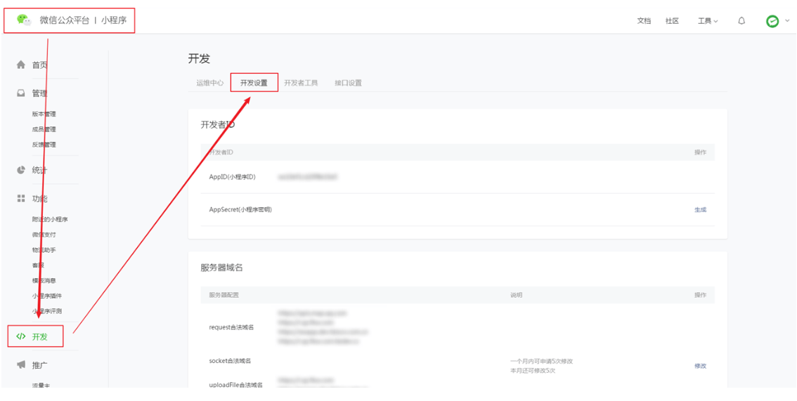
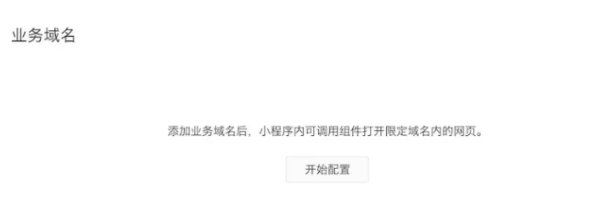
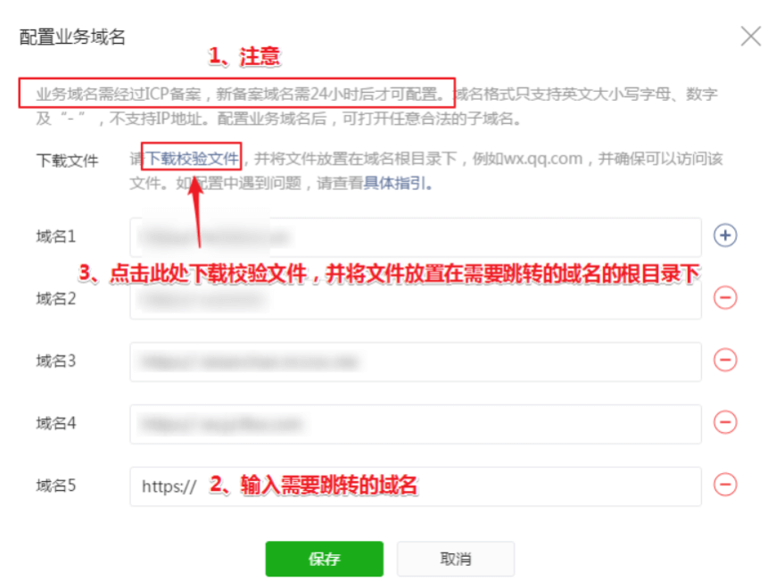
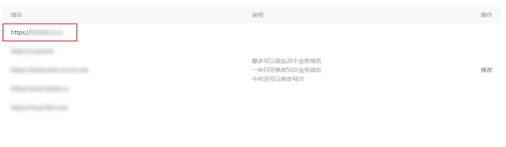
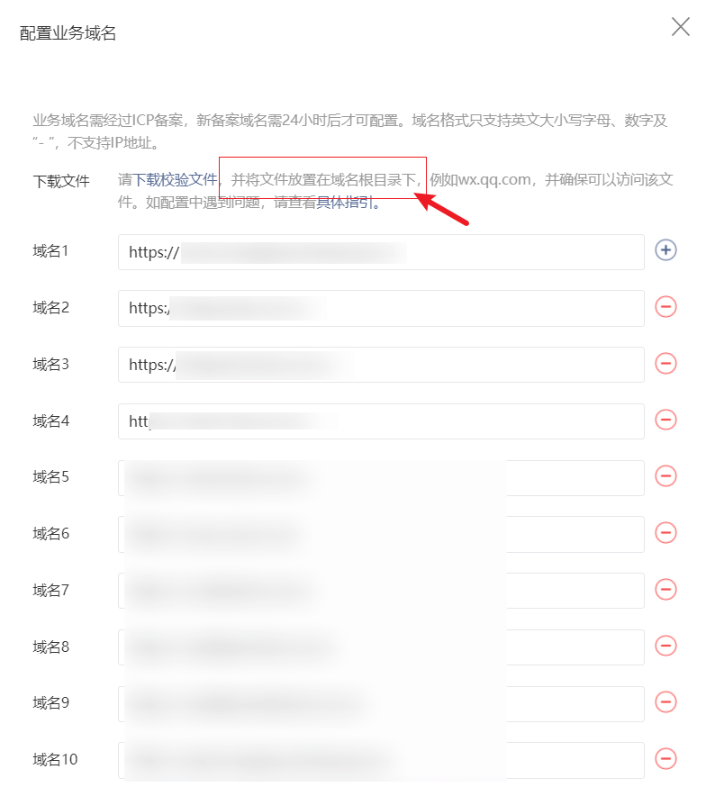

# 小程序中配置业务域名

## 一、微信小程序配置业务域名有什么作用？
企业主体的微信小程序，<b>配置业务域名后，支持跳转任意外部链接。</b> 
（需要跳转到哪个外部链接，就将那个链接配置为业务域名。）

<!-- 

<PageView /> -->

## 二、微信小程序如何配置业务域名？

:::tip 温馨提示
1. 一个微信小程序账号最多支持配置20个业务域名
2. 配置业务域名时，域名前需要加上 <b>https://</b>
3. 由于微信小程序审核发布成功后，外部链接会被微信清除掉。因此，如需在微信小程序中设置跳转外部链接，建议按以下步骤操作： <b>成功审核发布微信小程序 —— 解除所有第三方平台授权（包括轻应用小程序） —— 配置好业务域名 —— 重新授权给轻应用小程序</b>

:::

#### 进入【开发-开发者设置-业务域名】中，开始配置业务域名

:::tip
配置业务域名需小程序管理员扫码验证
:::

#### 输入需要跳转的域名，然后点击下载校验文件，并将文件放置在需要跳转的域名的根目录下

:::warning 
业务域名（即需要跳转的域名）需经过 ICP 备案，新备案域名需24小时后才可配置。域名格式只支持英文大小写字母、数字及“-”，不支持IP地址。

:::

#### 校验文件放置好后，点击保存按钮。校验成功后，输入的域名就会显示在业务域名中了，这就表示业务域名配置成功了

#### 放置成功后，将校验文件放在需要跳转的域名根目录文件下

参考链接：[如何在小程序配置域名](https://www.91jinteng.com/h-nd-193.html?fromColId=203)
