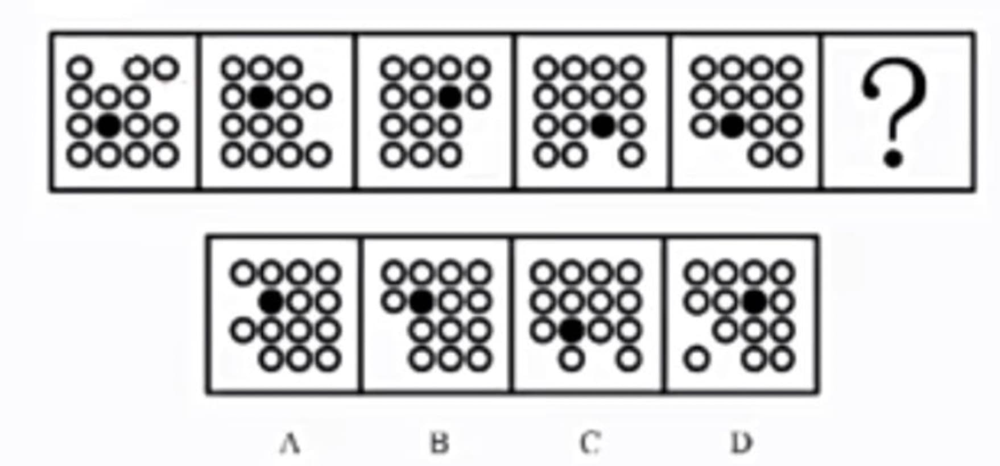
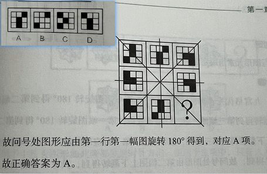
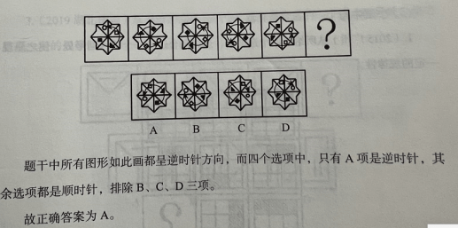
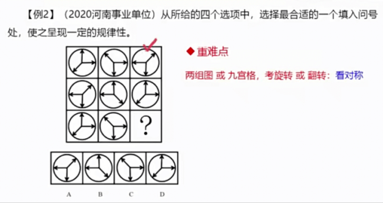

# 第一章、 图形推理
::: tip 平面推理综述
1. 当看到 <strong>数字时</strong>，要告诉自己 <strong>这是图形</strong>。（<strong><u>抛弃奇偶、等差等特性，看图形解构</u></strong>）
2. <strong>图形特征决定推理的方向，具体情况如下：</strong>
    + 图形元素组成相同，一般考查 <strong>位置规律</strong>
    + 图形元素组成相似，一般考查 <strong>样式规律</strong>
    + 图形元素组成不同，一般考查 <strong>属性规律、数量规律</strong>及<b>其他特殊规律</b>
:::

## 一、位置规律
### 1. 平移 

 

#### 1.1 平移的方向
+ <b>直线方向：</b> 上下平移、左右平移
+ <b>时针方向：</b> 顺时针平移、逆时针平移
+ <b>元素位置互换</b>
#### 1.2 平移的步长
+ <b>恒定</b>
+ <b>递增 或 递减</b>

#### 思维小结：

:::info 九宫格或十六宫格图形中元素平移方向的判定方式如下：
1. 如果平移元素只在<b><u>九宫格或十六宫格图形的</u>最外圈出现</b>，优先考虑元素在最外圈<b>按时针方向平移</b>
2. 如果平移元素出现在<b>非最外圈位置</b>，优先考虑<b>直线方向平移</b>
3. 每幅图形<b>按行</b><b>看黑块数量一致</b>，优先考虑<b>左右平移</b>；<b>按列</b><b>看黑块数量一致</b>，优先考虑<b>上下平移</b>
4. 在<b>平移题目</b>中，<b>“从头跑”</b>比较普遍，应优先考虑
5. 九宫格优先<b>横着看</b>
6. 九宫格考平移的时候，可以<b><u>从最简单的图入手</u></b>，然后可以<b>首先看中间部分，采用“回字法”看规律；如无规律，可再看直线平移</b>
7. <b>16格分内外圈走法</b>
8. <b>空白</b>也可以作为平移的小元素

:::

### 2. 旋转和翻转

 

#### 2.1 旋转
+ <b>旋转的方向：顺时针旋转和逆时针旋转</b>
+ <b>旋转的角度</b>

#### 2.2 翻转
+ <b>以x轴进行上下翻转，以y轴进行左右翻转</b>
+ <b>翻转之后再旋转，可利用“时针法”进行判断</b>
+ <b>九宫格中间为空白面，考虑米字线路，对称翻转</b>
+ <b>当小元素较多时，可以连成一个圆时，可以考虑时针法</b>

    

        中间为空白面，米字线路:
    

    

    

        小元素较多，连成一个圆时:
    

    

    

        <b>两组图 或 九宫格，考旋转或翻转: 看对称</b>（如下：第三个图 和 第二个图对称）
    

    

## 二、样式规律
