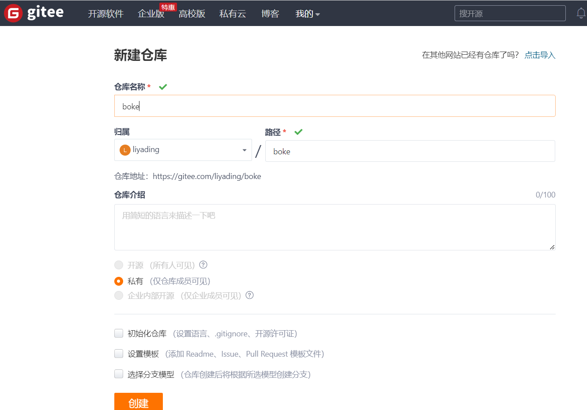
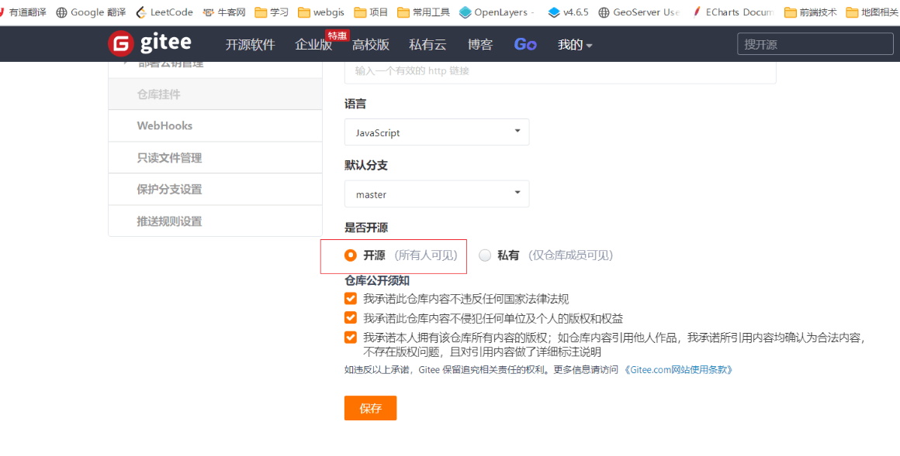
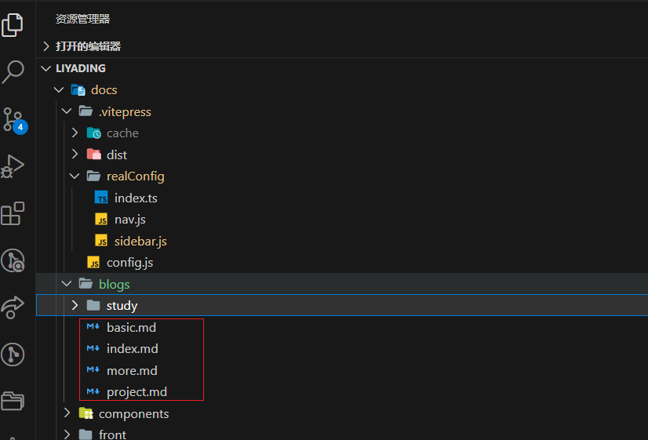
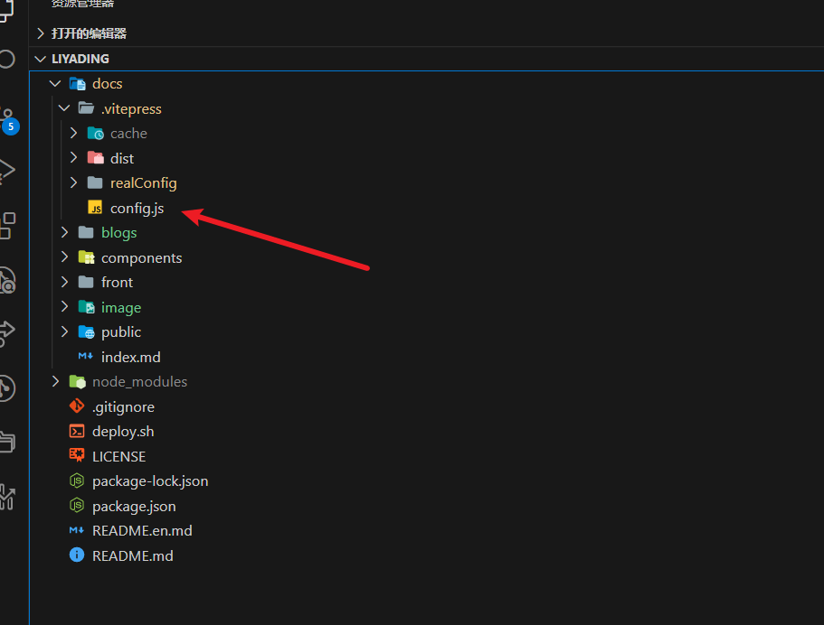
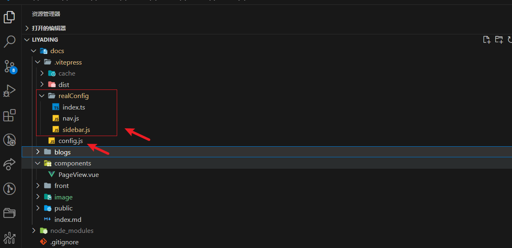
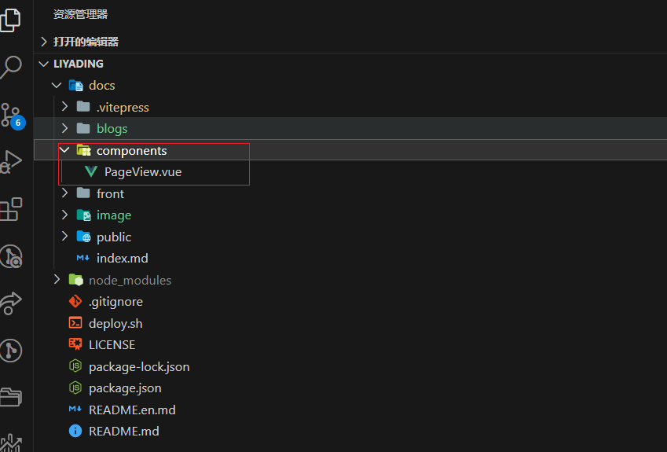
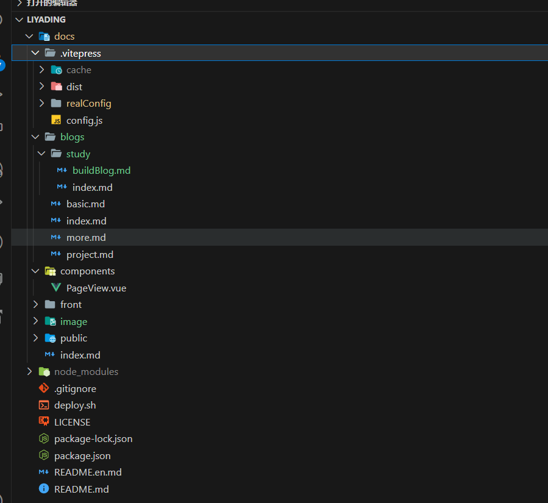
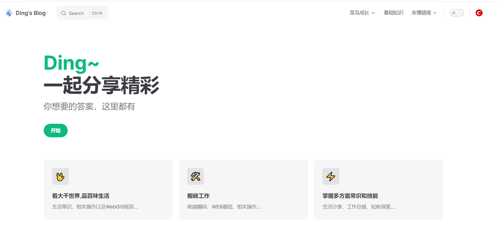
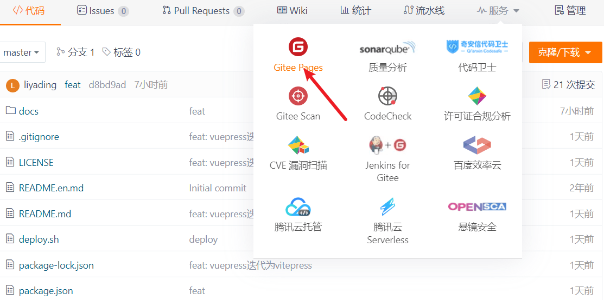

# vitepress + gitee pages搭建自己的博客

## 概述
VitePress是一个静态网站生成器，内容使用Markdown语法，配置简单，同时附带了一个默认主题，即使不需要写前端代码，也可以生成一个静态网站。底层使用Vite和Vue3，前端开发者可方便的进行修改或定制。

:::warning 注意：下面所述的安装过程和版本说明皆参考与对应工具的官网，后续可能会有更新或变动，以官网为准。
:::


## 安装过程
### 1. 创建<font color="#dd0000">gitee</font>工程


### 2. 创建完后公开仓库
gitee先在改了规则，新创建工程的时候只能创建为私有化仓库，创建完之后再通过管理修改仓库基本信息将仓库公开后才能使用
<font color="#dd0000">gitee pages</font>。不过<font color="#dd0000">gitee pages</font>
是需要上传个人信息认证的，认证过之后就不需要再认证了。




### 3. 初始化 `vitepress`
:::warning
1. 首先需要本地安装Node.js，需要16版本及以上。
2. 推荐使用pnpm，命令行安装npm install -g pnpm。
3. 创建工程，安装VitePress。首先创建文件夹，并打开命令行。
:::

#### 3.1 `vitepress` 初始化, 添加依赖
```js
// 下载代码
git clone https://gitee.com/liyading/liyading.git
// 进入目录
cd liyading
// 初始化工程
npm init -y 或 pnpm init
// 添加依赖
npm i vitepress sass -D 或 pnpm add -D vitepress

```

#### 3.2 添加运行脚本
修改<font color="#dd0000">package.json</font>并添加运行脚本
```js
{
  "name": "liyading",
  "version": "1.0.0",
  "description": "gn",
  "main": "index.js",
  "keywords": [],
  "author": "",
  "license": "ISC",
  "dependencies": {
    "vitepress": "^1.0.0-alpha.32"
  },
  "devDependencies": {
    "sass": "^1.57.0"
  },
  "scripts": {
    "dev": "vitepress dev docs",
    "build": "vitepress build docs",
    "serve": "vitepress serve docs"
  },
  "directories": {
    "doc": "docs"
  }
}

```

#### 3.3 创建<font color="red">docs/index.md</font> 文件
在工程目录下创建 <font color='red'>docs</font> 目录，并添加 <font color='red'>index.md</font> 文件。此时已完成vitepress工程的初始化

### 4. VitePress 添加本地搜索功能
<br />

#### 安装插件

```js
npm i vitepress-plugin-search markdown-it flexsearch -D
```

#### 添加和配置插件

```js
//vite.config.ts
import { SearchPlugin } from "vitepress-plugin-search";
import { defineConfig } from "vite";
import flexSearchIndexOptions from "flexsearch";
//default options
var options = {
  ...flexSearchIndexOptions,
  previewLength: 100, //搜索结果预览长度
  buttonLabel: "搜索",
  placeholder: "情输入关键词",
}

export default defineConfig({
  plugins: [SearchPlugin(options)],
})
```
参考链接：[VitePress配置](https://chodocs.cn/program/vitepress-local-search/)


## 创建博客

### 1. 编写博客首页
博客首页为 <font color='red'>docs/index.md</font>，修改其文件内容为：
```md
---
layout: home
hero:
  name: Ding~
  text: 一起分享精彩
  tagline: 你想要的答案，这里都有
  image:
    src: image.png
    alt: image
  actions:
    - theme: brand
      text: 开始
      link: /blogs/
features:
- icon: 🖖
  title: 看大千世界,品百味生活
  details: 生活常识、相关操作以及WebGIS框架...

- icon: 🛠️
  title: 搬砖工作
  details: 前端编码、WEB基础、相关操作...

- icon: ⚡️
  title: 掌握多方面常识和技能
  details: 生活分享、工作总借、知新探索...
---

```

### 2. 添加博客内容
在docs目录下创建 <font color='red'>blogs</font> 目录，并添加如下文件 


### 3. 添加配置文件
在docs目录下创建 <font color='red'>.vitepress</font> 目录下创建 <font color='red'>config.js</font>文件


:::tip
我们这里在搭建工程的时候, 考虑到侧边栏和导航栏的模块化, 故将 <font color='red'>sidebar 和 nav</font> 拆分出去了
:::

<details>
    <summary>
        <font color='blue'>拆分步骤:</font>
    </summary>
    拆分步骤1: 在<font color='red'>.vitepress</font>文件夹下创建模块文件夹<font color='red'>realConfig</font><br>
    拆分步骤2: <font color='red'>realConfig</font>文件夹下创建对应的<font color='red'>index.js、sidebar.js 和 nav.js文件</font><br>
    拆分步骤3: <font color='red'>config.js</font>文件引入<font color='red'>sidebar.js 和 nav.js文件</font><br>
</details>



:::warning 注意
当拆分侧边栏和导航栏时, 在 <font color='blue'>.vitepress</font> 文件夹下不能创建以 <font color='blue'>config</font> 同名的文件夹, 因为 `vitepress` 会默认把它当成 `config.js`, 我们在这里以 <font color='blue'>realConfig</font> 命名 
:::

<font color='blue'>文件内容如下👇👇👇</font>

```js
// sidebar.js 
export const sidebar = {
    '/blogs/study': [
        {
            text: '利其器',
            collapsible: true,
            items: [
                {text: '可能不知道的实用网站', link: '/blogs/study/index'},
                {text: 'vitepress+gitee pages搭建博客', link: '/blogs/study/buildBlog'},
            ]
        }
    ],
    '/front/': [
        {
            text: '前端',
            collapsible: true,
            items: [
                {text: '测试', link: '/front/'},
                {text: '测试基础', link: '/front/basic'},
                {text: '项目实战', link: '/front/project'},
                {text: '高级进阶', link: '/front/more'},
            ]
        }
    ]
}

```

```js
// nav.js
export const nav = [
    {
        text: '菜鸟成长',
        items: [
            { text: '实用工具', link: '/blogs/study/index' },
        ]
    },
    {
        text: '基础知识',
        link: '/front/'
    },
    {
        text: '友情链接',
        items: [
            { text: 'CSDN', link: 'https://blog.csdn.net/GISShiXiSheng' },
            { text: '测试链接', link: '/blogs/basic' },
        ]
    }
]

```

```js
// index.js
export * from './nav'
export * from './sidebar'

```

```js
// config.js 引入
import { defineConfig } from 'vitepress'
import { sidebar, nav } from './realConfig'

export default defineConfig({
    title: 'liyading的博客',
    description: '从工作到生活，这里都有',
    lang: 'zh-CN',
    base: '/liyading/',
    head: [
        // 添加图标
        ['link', { rel: 'icon', href: '/logoD.png' }]
    ],
    themeConfig: {
        // 网站 logo
        logo: '/logoD.png',
        // 网站标题
        siteTitle: 'Ding\'s Blog',
        // 启动页面丝滑滚动
        smoothScroll: true,
        search: {
            provider: 'local'
        },
        // 社交账户链接
        socialLinks: [
            {
                icon: {
                    svg: '<svg t="1671270414569" class="icon" viewBox="0 0 1024 1024" version="1.1" xmlns="http://www.w3.org/2000/svg" p-id="2135" width="64" height="64"><path d="M512 0c282.784 0 512 229.216 512 512s-229.216 512-512 512S0 794.784 0 512 229.216 0 512 0z m189.952 752l11.2-108.224c-31.904 9.536-100.928 16.128-147.712 16.128-134.464 0-205.728-47.296-195.328-146.304 11.584-110.688 113.152-145.696 232.64-145.696 54.784 0 122.432 8.8 151.296 18.336L768 272.704C724.544 262.24 678.272 256 599.584 256c-203.2 0-388.704 94.88-406.4 263.488C178.336 660.96 303.584 768 535.616 768c80.672 0 138.464-6.432 166.336-16z" fill="#CE000D" p-id="2136"></path></svg>'
                },
                link: 'https://blog.csdn.net/GISShiXiSheng'
            }
        ],
        // 导航栏配置
        nav,
        // 左侧边栏配置
        sidebar,
        // 右侧边栏标题
        outline: 'deep',
        outlineTitle: '章节导航',
        // 上下篇文本提示文字
        docFooter: {
            prev: '←上一篇',
            next: '下一篇→'
        },

        // 上次更新时间提示文字
        lastUpdatedText: '上次更新时间',
        // 编辑链接
        // editLink: {
        //     text: '我的博客',
        //     pattern: 'https://www.csdn.net/'
        // },
        // 页面底部
        footer: {
            message: '',
            copyright: 'Copyright © 2023 LIYADING'
        }
    }
})

```

### 4. 添加 <font color='red'>vue</font> 组件
在 `docs` 目录下创建 <font color='red'>components</font> 目录，`vue` 组件可放在此目录


### 5. 添加静态资源
在 `docs` 目录下创建 <font color='red'>public</font> 目录，所有的静态资源都放在该目录下面。此时一个比较完整的vitepress博客工程搭建完成，完整的目录文件结构如下图：


运行后效果如下:



## gitee pages 发布

### 1. 打包工程
运行命令 <font color='red'>npm run build</font> 打包，打包后的文件位于在 <font color='red'>docs/.vitepress/dist</font>。上传代码和打包资源到 `gitee`

### 2. 发布博客
点击服务 → Gitee Pages


选择要发布的分支，并输入部署目录<font color='red'>docs/.vitepress/dist</font>，点击”启动” 或 "更新" 按钮开启。


