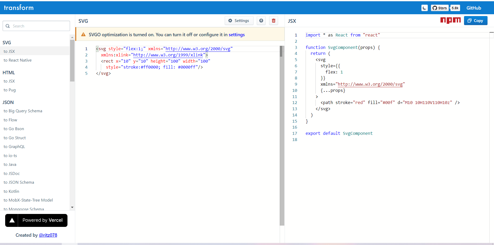
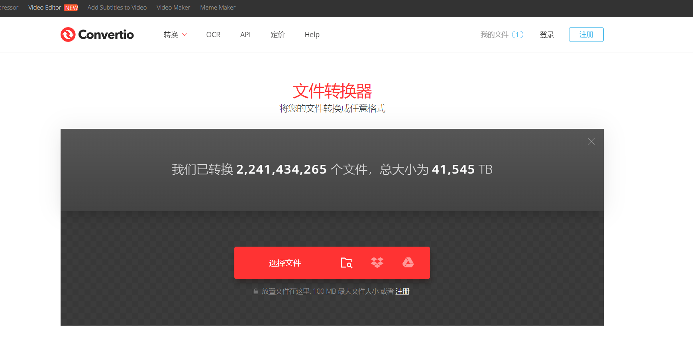
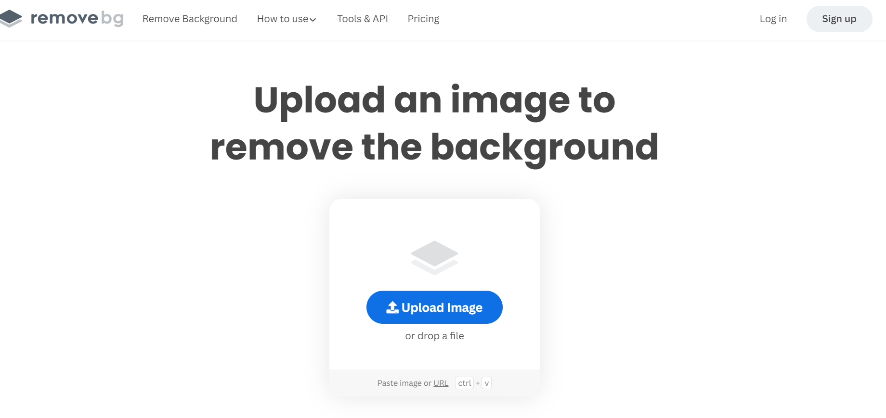
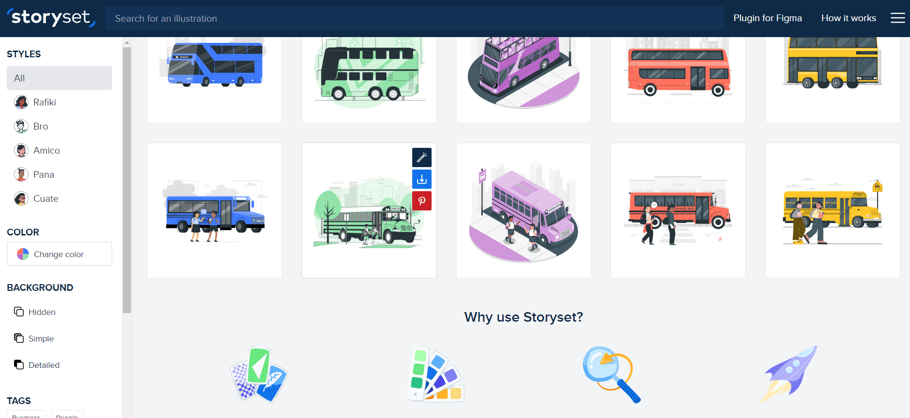
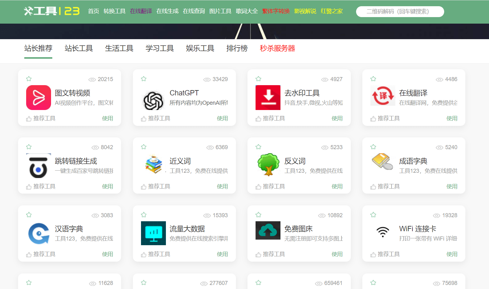
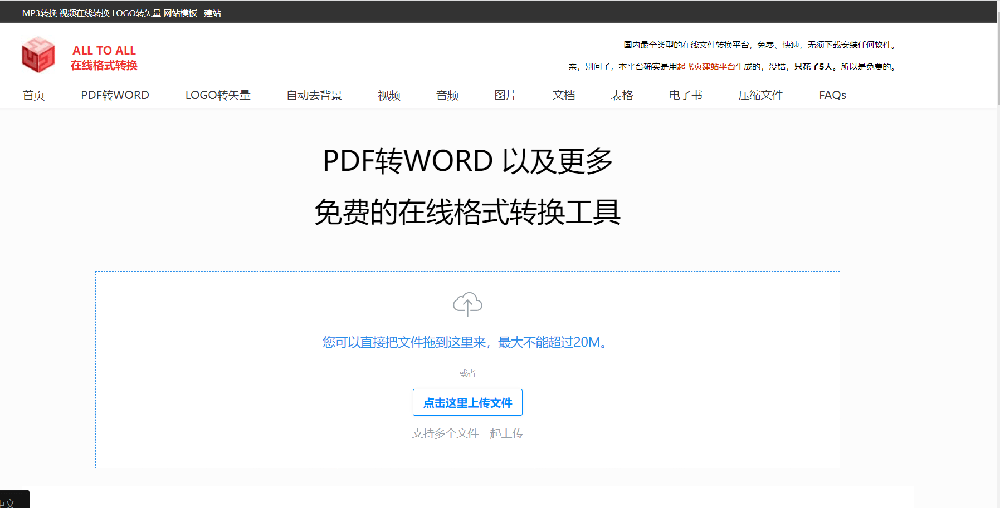
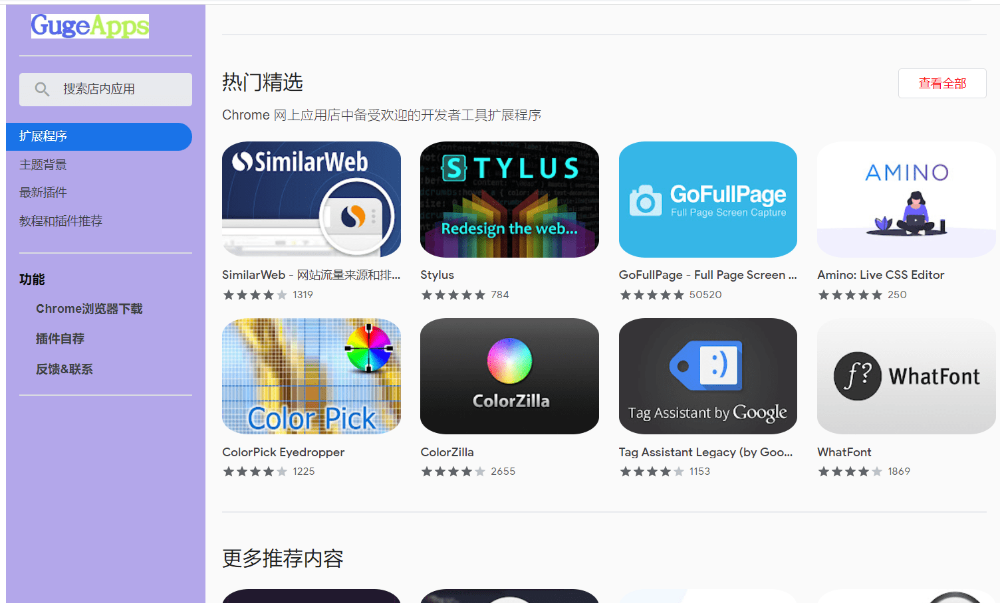

# 你可能喜欢的实用网站

## 概述
在本文中，我将分享一些非常有用的网站合集，这些网站可以在你的日常工作中极大地帮助你。这些网站已经成为我各种任务的首选资源，节省了我的时间，提高了工作效率.

### 1. Transform.tools
地址: [https://transform.tools/](https://transform.tools/)

transform.tools 是一个多功能的网站，可以将各种元素进行转换，例如将HTML转换为JSX，JavaScript转换为JSON，CSS转换为JS对象等等。每当我需要快速转换任何内容时，它都是一个真正的时间节省器。

### 2. Convertio
地址：[https://convertio.co/zh/](https://convertio.co/zh/)

Convertio是一个用户友好的在线文件转换工具。它支持超过309种不同的文档、图像、电子表格、电子书、存档、演示文稿、音频和视频格式。通过Convertio，您可以轻松地转换文件类型，如PNG到JPEG，SVG到PNG，PNG到ICO等等。

### 3. 移除背景
地址：[https://www.remove.bg/](https://www.remove.bg/)

Removebg 是一个令人难以置信的工具，它简化了从任何图像中去除背景的过程。它能迅速检测图像中的主体并去除背景，为您提供一个透明的PNG图像，可以轻松地在各种项目中使用。无论您是在进行平面设计、照片编辑还是其他涉及图像的项目，Removebg都是一个救命稻草。

### 4. Storyset
地址：[https://storyset.com/](https://storyset.com/)

Storyset是一个强大的平台，为你的下一个项目提供了一系列令人惊叹的免费可定制插图。通过Storyset，我们可以轻松定制、动画化并下载插图，以创建令人难以置信的落地页、应用程序或演示文稿。

### 5. 工具123
地址：[http://www.gjw123.com/](http://www.gjw123.com/)

### 6. 在线格式转换
地址：[https://www.alltoall.net/](https://www.alltoall.net/)

### 7. GUgeApps
地址[https://www.gugeapps.net/webstore/category/ext/11-web-development](https://www.gugeapps.net/webstore/category/ext/11-web-development)
